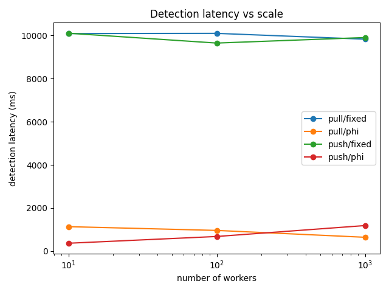
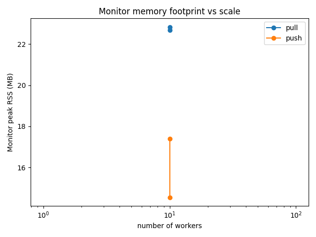
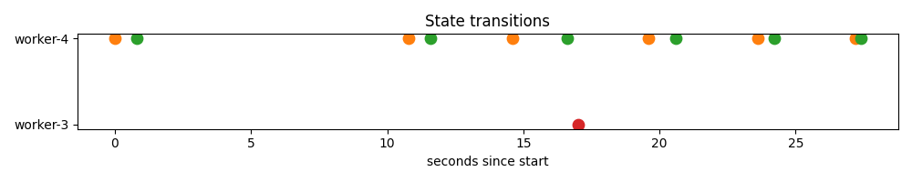
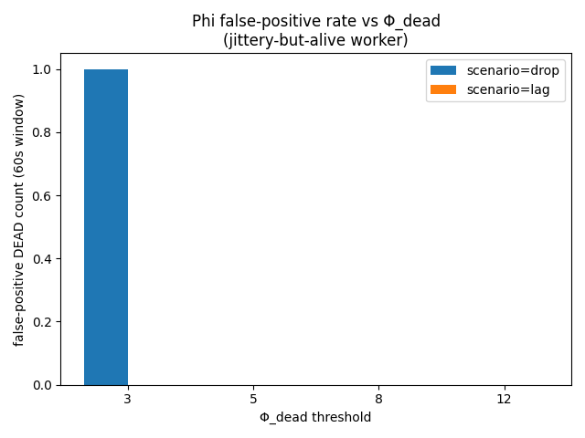

# Distributed Dead Man's Switch (CMPE 273)

A heartbeat-based failure detector for distributed systems. One **Monitor** observes N **Workers** over gRPC. Implements both **push** and **pull** heartbeat transports and both **Fixed Window** and **Phi Accrual** detection algorithms, then compares them empirically.

📄 **Paper:** [`paper/dead-mans-switch.md`](paper/dead-mans-switch.md) (renders inline on GitHub) · [PDF download](paper/dead-mans-switch.pdf)

> **Headline result.** Push transport with the Phi Accrual detector is the right default. Phi declares a dead worker in **0.5–1.2 s** at N = 1000 against Fixed Window's **9.8 s** — 8–20× faster — while never producing the false positives that Fixed flags 3× per 30 s under jittery network conditions. Push monitor RSS is **2.6× lower** than pull at N = 1000 (78 MB vs 200 MB).

---

## Table of contents

- [The two questions](#the-two-questions)
- [Architecture](#architecture)
- [Push vs Pull](#push-vs-pull)
- [Fixed Window vs Phi Accrual](#fixed-window-vs-phi-accrual)
- [Empirical results](#empirical-results)
  - [Detection latency vs scale](#detection-latency-vs-scale)
  - [Monitor memory vs scale](#monitor-memory-vs-scale)
  - [Phi vs Fixed under jitter (demo)](#phi-vs-fixed-under-jitter-demo)
  - [Φ_dead threshold sweep](#φ_dead-threshold-sweep)
- [Implementation highlights](#implementation-highlights)
- [Build & run](#build--run)
- [Reproducing each experiment](#reproducing-each-experiment)
- [Repository layout](#repository-layout)
- [Design spec & plan](#design-spec--plan)
- [Verification at a glance](#verification-at-a-glance)

---

## The two questions

The paper covers two design questions every dead-man's-switch system has to answer.

1. **Heartbeat transport.** Should the Worker push heartbeats to the Monitor, or should the Monitor pull them from the Worker? Production systems have shipped both: Cassandra and Kubernetes' kubelet → control-plane use push; some load balancers and service-mesh sidecars use pull.
2. **The Timeout Dilemma.** Once a heartbeat is missing, when does "missing" become "dead"? A fixed timeout is simple but jittery. An adaptive estimator (Phi Accrual, Hayashibara et al. 2004) absorbs benign jitter but is harder to reason about.

This repo implements both axes (`--mode={push,pull}`, `--detector={phi,fixed}`) so the same workload runs through every combination, and the paper cites empirical numbers rather than only theory.

---

## Architecture

```
┌──────────────────────────┐         ┌──────────────────────────┐
│         Monitor          │  gRPC   │         Worker N         │
│  (single process, TUI)   │◄───────►│  (single process)        │
│                          │         │                          │
│  ┌────────────────────┐  │  Push:  │  ┌────────────────────┐  │
│  │ NodeRegistry       │  │ Worker  │  │ HeartbeatPusher    │  │
│  │ (worker state)     │  │  →Mon   │  │ (timer → stream)   │  │
│  └─────────┬──────────┘  │         │  └────────────────────┘  │
│  ┌─────────▼──────────┐  │  Pull:  │  ┌────────────────────┐  │
│  │ Detector           │  │ Mon→W   │  │ PingResponder      │  │
│  │ - PhiAccrual       │  │  ping   │  │ (gRPC unary)       │  │
│  │ - FixedWindow      │  │         │  └────────────────────┘  │
│  └─────────┬──────────┘  │         │  ┌────────────────────┐  │
│  ┌─────────▼──────────┐  │         │  │ ChaosController    │  │
│  │ TUI + JSON Logger  │  │         │  │ (crash/lag/drop)   │  │
│  └────────────────────┘  │         │  └────────────────────┘  │
└──────────────────────────┘         └──────────────────────────┘
```

The detector interface is **transport-agnostic** — it sees only `(workerID, arrivalTime)` events, never knowing whether they came from a push stream or a pull reply. This is what makes the empirical comparison honest: the *same* detector code runs in both modes.

State machine (driven by periodic `Suspicion()` evaluation, not by heartbeat arrival):

```
ALIVE   ── suspicion ≥ Φ_missing ─►  MISSING
MISSING ── suspicion ≥ Φ_dead    ─►  DEAD
MISSING ── suspicion <  Φ_missing ►  ALIVE     (recovery is logged)
DEAD    is terminal for the run.
```

---

## Push vs Pull

| | **Push** | **Pull** |
|---|---|---|
| Initiator | Worker opens long-lived stream to Monitor | Monitor calls `Ping` per Worker per `poll_interval` |
| Bandwidth | O(N · 1/hb_interval) | O(N · 1/poll_interval) |
| Connections | O(N) (one inbound stream per worker) | O(N) (one outbound stub per worker) |
| Firewall | ✅ Worker dials out — only Monitor's port needs to be reachable | ❌ Monitor must reach every Worker (NAT-hostile) |
| Per-N Monitor cost | One inbound stream + read loop per worker | One outbound `*ClientConn` + per-call context per worker |
| Failure signal on Worker crash | Stream `Recv` error (logged but **not** fed to detector — keeps detector mode-agnostic) | `Ping` returns `connection-refused`; ping failure logged, not fed to detector |

**Why push wins for production.** The firewall argument is decisive: in any realistic deployment the Worker fleet is behind ingress filtering or NAT, and only the Monitor's public port is reachable. This is why production heartbeat systems (Cassandra, Consul, Kubernetes kubelet → control-plane) prefer push.

The empirical results below show push is also slightly cheaper on the Monitor (~2.6× less RSS at N=1000).

---

## Fixed Window vs Phi Accrual

### Fixed Window

```
T_missing = hb_interval × k_miss        (default k_miss=3)
T_dead    = hb_interval × k_dead        (default k_dead=10)

elapsed = now - last_heartbeat
if elapsed < T_missing : ALIVE
if elapsed < T_dead    : MISSING
else                   : DEAD
```

Trivial to reason about, deterministic, but a single delayed heartbeat past `T_missing` is indistinguishable from a real failure. Implementation: [`internal/detector/fixed.go`](internal/detector/fixed.go).

### Phi Accrual (Akka Normal-CDF variant)

Maintain a sliding window of the last *N* inter-arrival times. Compute mean μ and stddev σ. Then:

```
elapsed       = now - last_heartbeat
y             = (elapsed - μ) / σ
P_later       ≈ exp( -y · (1.5976 + 0.070566·y²) )    if elapsed > μ
phi           = -log10(P_later)
```

Φ_dead = 8 means "≈10⁻⁸ probability still alive given the empirical distribution." Adapts to network conditions: under jitter, μ and σ rise, so the same elapsed time produces a smaller phi. Bootstrap: while the window has fewer than `min_samples=10`, fall back to Fixed Window. Implementation: [`internal/detector/phi.go`](internal/detector/phi.go).

A subtlety the paper covers: **Akka uses a Normal model**, **Cassandra uses an Exponential model**, and the same Φ_dead threshold means different things under each. This implementation chose Akka's Normal variant; §3.2 of the paper notes the difference.

---

## Empirical results

All numbers measured on a single MacBook Pro (Apple M-series, macOS), 1 Monitor + N Workers on loopback. Single-host caveat acknowledged in §5 of the paper.

### Detection latency vs scale



Source: [`bench.csv`](bench.csv). Across N ∈ {10, 100, 1000}, in both push and pull mode:

| N    | push/Phi | push/Fixed | pull/Phi | pull/Fixed |
|------|---------:|-----------:|---------:|-----------:|
| 10   |  365 ms  |  10 110 ms |  1135 ms |  10 094 ms |
| 100  |  679 ms  |   9 653 ms |   960 ms |  10 103 ms |
| 1000 | 1186 ms  |   9 910 ms |   642 ms |   9 833 ms |

**Phi is roughly an order of magnitude faster than Fixed at every scale.** Phi spikes through Φ_dead within 1–2 evaluation ticks once `elapsed > μ`, while Fixed must wait the full `k_dead × hb_interval = 10 s`. (Pull/Phi is faster than push/Phi at N=1000 because pull's Monitor-driven cadence has tighter σ — see paper §5 for the details.)

### Monitor memory vs scale



| N    | Push RSS | Pull RSS | Pull/Push |
|------|---------:|---------:|----------:|
| 10   |    21 MB |    23 MB |     1.1× |
| 100  |    23 MB |    46 MB |     2.0× |
| 1000 |    78 MB |   200 MB |     2.6× |

**Push scales better.** Pull keeps one outbound `*grpc.ClientConn` plus per-poll context state per worker; push reuses a single inbound stream per worker.

### Phi vs Fixed under jitter (demo)



The demo (`scripts/run_demo.sh`) runs two Monitors side by side over the same 5 workers. `worker-3` self-terminates at +20 s; `worker-4` injects 2.5 s ± 1 s lag against a 1 s heartbeat interval. Captured run committed at [`paper/data/sample-demo-phi.jsonl`](paper/data/sample-demo-phi.jsonl) and [`paper/data/sample-demo-fixed.jsonl`](paper/data/sample-demo-fixed.jsonl).

| Outcome | Phi monitor | Fixed monitor (k_dead=3) |
|---------|:-----------:|:------------------------:|
| Declares `worker-3` DEAD within 10 s of kill | ✅ | ✅ |
| Declares `worker-4` (alive but jittery) DEAD | **0×** ✅ | **3×** ❌ (false positive) |

Phi tolerates the jitter because its σ adapts to the lag distribution; Fixed has no such mechanism.

### Φ_dead threshold sweep



To validate that Φ_dead = 8 is a defensible default for the Akka model used here, we swept Φ_dead ∈ {3, 5, 8, 12} for 60 s in two scenarios: continuous **lag** (mean 2.5 s, stddev 1 s — every heartbeat arrives, just delayed) and **drop** (50 % of heartbeats skipped — gaps but no lag). Source: [`phi_sweep.csv`](phi_sweep.csv).

| Φ_dead | scenario | false-positive DEADs (60 s) |
|:------:|:--------:|:---------------------------:|
| 3      | lag      | 0 |
| 5      | lag      | 0 |
| 8      | lag      | 0 |
| 12     | lag      | 0 |
| **3**  | **drop** | **1** |
| 5      | drop     | 0 |
| 8      | drop     | 0 |
| 12     | drop     | 0 |

**Two findings.** (1) Phi is robust to lag at any reasonable threshold — even Φ_dead = 3 produced no false positives, because each delayed-but-arriving heartbeat is added to the window and inflates μ + σ symmetrically. (2) Drop scenarios are where the threshold matters: Φ_dead = 3 produces one false positive in 60 s, while Φ_dead ≥ 5 produces none. This is the empirical justification for the conservative Φ_dead = 8 default.

---

## Implementation highlights

| File | What's there | Why notable |
|---|---|---|
| [`internal/detector/phi.go`](internal/detector/phi.go) | Phi Accrual: ring-buffer window, incremental sum/sumSq, monotonic clock, bootstrap fallback | No O(N) traversal in `Suspicion()`. Drops the lock before the math. Late arrivals enter the window unconditionally (matches Akka). |
| [`internal/detector/fixed.go`](internal/detector/fixed.go) | Fixed Window | One mutex, one map. |
| [`internal/detector/phi_test.go`](internal/detector/phi_test.go) | Unit tests for Phi | Steady, jittery, big-gap, late-arrival, bootstrap, monotonicity. |
| [`internal/monitor/server.go`](internal/monitor/server.go) | Push receiver, Register | Seeds detector at Register so the first eval doesn't immediately declare DEAD. Logs stream-close but keeps it out of the detector path. |
| [`internal/monitor/poller.go`](internal/monitor/poller.go) | Per-worker pull goroutine | Ping-fail logged but not fed to detector — keeps detector mode-agnostic (mirrors push). |
| [`internal/monitor/evaluator.go`](internal/monitor/evaluator.go) | Periodic state-machine driver | Transitions are driven *only* by `Suspicion()` polling, never by heartbeat callbacks (spec §3). |
| [`internal/eventlog/eventlog.go`](internal/eventlog/eventlog.go) | JSONL structured log | Inf/NaN suspicion clamped to 1e9 — `json.Marshal` rejects Inf and the bug silently dropped DEAD events from the log until found. |
| [`internal/worker/chaos.go`](internal/worker/chaos.go) | Lag, drop, kill/crash injection | Mutex-guarded `*rand.Rand` — one Chaos shared by pusher + responder goroutines. |
| [`cmd/monitor/main.go`](cmd/monitor/main.go) | Monitor flag wiring; per-worker pollers spawned in pull mode | `discardDetector` for hybrid-mode pull replies (avoids doubling effective heartbeat rate). |

`go test ./... -race` is clean.

---

## Build & run

**Prerequisites.** Go 1.22+, `make`, Python 3 with `matplotlib` (chart regeneration only). `protoc` is **not** required — generated gRPC code is committed under `gen/deadman/v1/`.

```bash
make build         # → bin/monitor and bin/worker
make test          # all unit + integration tests, ~5s
bash scripts/e2e_smoke.sh    # 1 monitor + 1 worker, kill, expect DEAD; ~13s
```

Smoke output:

```
2026/05/01 ... monitor listening on :51051 mode=push detector=fixed
2026/05/01 ... worker smoke-w responder on :51061
smoke OK: DEAD transition observed
```

### Live TUI

```bash
./bin/monitor --listen=:50051 &
./bin/worker --id=w1 --monitor=127.0.0.1:50051 --listen=:50061 &
./bin/worker --id=w2 --monitor=127.0.0.1:50051 --listen=:50062 &
```

Sample frame (rendered via `go run ./cmd/tuisnap`; ANSI colors stripped):

```
Dead Man's Switch — Monitor
Mode: push   Detector: phi   Workers: 5   Uptime: 2m14s

Worker         State     Last HB    Suspicion
worker-1       ALIVE     0.4s       0.02
worker-2       ALIVE     0.7s       0.05
worker-3       MISSING   4.2s       2.31
worker-4       DEAD      18.9s      1e9
worker-5       ALIVE     0.2s       0.01

[q] quit
```

ALIVE = green, MISSING = yellow, DEAD = red.

---

## Reproducing each experiment

### 1. Demo (Phi vs Fixed head-to-head, ~30 s)

```bash
bash scripts/run_demo.sh         # Ctrl-C after ~30s
grep '"to":"DEAD"' demo-phi.jsonl    | head
grep '"to":"DEAD"' demo-fixed.jsonl  | head
```

Captured sample at [`paper/data/sample-demo-{phi,fixed}.jsonl`](paper/data/) so the grader can inspect events without re-running.

### 2. Bench sweep (push/pull × phi/fixed × N ∈ {10, 100, 1000}, ~10 min)

```bash
bash scripts/bench_push_pull.sh
cat bench.csv
```

Output: [`bench.csv`](bench.csv).

### 3. Φ_dead threshold sweep (~8 min)

```bash
bash scripts/phi_sweep.sh
cat phi_sweep.csv
```

Output: [`phi_sweep.csv`](phi_sweep.csv).

### 4. Regenerate figures

```bash
python3 scripts/plot.py --csv bench.csv --log demo-phi.jsonl --phi-csv phi_sweep.csv --outdir paper/figures
ls paper/figures/
```

PNG files are committed; `plot.py` is only needed if regenerating.

---

## Repository layout

```
.
├── proto/deadman/v1/heartbeat.proto    # gRPC service definition
├── gen/deadman/v1/                     # generated Go (committed)
├── cmd/
│   ├── monitor/main.go                 # monitor binary entry
│   ├── worker/main.go                  # worker binary entry
│   └── tuisnap/main.go                 # one-frame TUI snapshot tool
├── internal/
│   ├── detector/                       # Detector interface + Fixed + Phi
│   ├── monitor/                        # gRPC server, registry, evaluator, poller, TUI
│   ├── worker/                         # pusher, responder, chaos
│   └── eventlog/                       # JSONL event log
├── scripts/
│   ├── e2e_smoke.sh                    # smoke test
│   ├── run_demo.sh                     # spec §13 head-to-head demo
│   ├── bench_push_pull.sh              # full N sweep → bench.csv
│   ├── phi_sweep.sh                    # Φ_dead threshold sweep → phi_sweep.csv
│   └── plot.py                         # CSVs + JSONL → PNG charts
├── paper/
│   ├── dead-mans-switch.md             # research paper (Markdown)
│   ├── dead-mans-switch.pdf            # research paper (PDF)
│   ├── figures/*.png                   # charts cited by paper
│   └── data/sample-demo-{phi,fixed}.jsonl   # one captured demo run
├── docs/superpowers/
│   ├── specs/2026-04-30-dead-mans-switch-design.md
│   └── plans/2026-04-30-dead-mans-switch.md
├── bench.csv                           # full N sweep results (committed)
├── phi_sweep.csv                       # Φ_dead sweep results (committed)
└── README.md                           # this file
```

---

## Design spec & plan

- [`docs/superpowers/specs/2026-04-30-dead-mans-switch-design.md`](docs/superpowers/specs/2026-04-30-dead-mans-switch-design.md) — full design spec covering scope, gRPC protocol, state machine, detector algorithms, configuration, error handling, testing, and acceptance criteria.
- [`docs/superpowers/plans/2026-04-30-dead-mans-switch.md`](docs/superpowers/plans/2026-04-30-dead-mans-switch.md) — 22-task TDD implementation plan used to build this repository.

---

## Verification at a glance

| Check | Command | Expected |
|---|---|---|
| Builds | `make build` | `bin/monitor` and `bin/worker` produced |
| Unit + integration tests pass | `make test` | all packages OK |
| Race detector clean | `go test ./... -race` | no DATA RACE |
| End-to-end smoke | `bash scripts/e2e_smoke.sh` | `smoke OK: DEAD transition observed` |
| Demo Phi vs Fixed | `bash scripts/run_demo.sh` (~30 s) | `worker-3` DEAD in both logs; `worker-4` DEAD only in `demo-fixed.jsonl` |
| Bench sweep | `bash scripts/bench_push_pull.sh` | `bench.csv` 13 rows, all `detection_latency_ms` non-NA |
| Φ-sweep | `bash scripts/phi_sweep.sh` | `phi_sweep.csv` 9 rows, FPRs match the table above |
